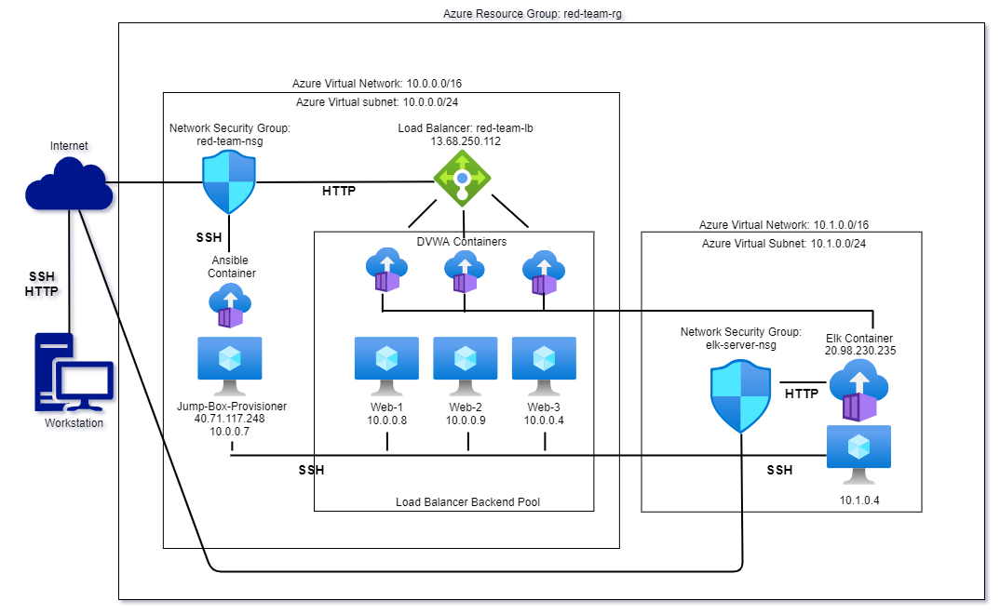

## Automated ELK Stack Deployment

The files in this repository were used to configure the network depicted below.

These files have been tested and used to generate a live ELK deployment on Azure. They can be used to either recreate the entire deployment pictured above, or alternatively, select portions of the playbook file may be used to install only certain pieces of it, such as Filebeat.

 [complete playbook file](playbooks/complete-deployment.yml)

This document contains the following details:
- Description of the Topology
- Access Policies
- ELK Configuration
  - Beats in Use
  - Machines Being Monitored
- How to Use the Ansible Build

### Description of the Topology

The main purpose of this network is to expose a load-balanced and monitored instance of DVWA, the D*mn Vulnerable Web Application.

Load balancing ensures that the application will be highly available, in addition to restricting access to the network.
The Jump Box acts as a management gateway to securely make changes to each of the VMs.

Integrating an ELK server allows users to easily monitor the vulnerable VMs for changes to the log files and system resource utilization.  Filebeat provides the former, while Metricbeat provides the latter functionality.

The configuration details of each machine may be found below.

| Name        | Function    | IP Address | Operating System |
|-------------|-------------|------------|------------------|
|  Jump Box   | Gateway     |  10.0.0.7  |      Linux       |
|  Web-1      | DVWA Server |  10.0.0.8  |      Linux       |  
|  Web-2      | DVWA Server |  10.0.0.9  |      Linux       |
|  Web-3      | DVWA Server |  10.0.0.4  |      Linux       |
|  Elk Server | Monitoring  |  10.1.0.4  |      Linux       |
### Access Policies

The machines on the internal network are not exposed to the public Internet.

Only the Load Balancer can accept public connections, and only over HTTP.  This ensures a secure architecture by not allowing users to connect directly to the individual DVWA containers.

The Elk Server and Jump Box have publicly facing IPs as well, however access is limited to a single IP address and filtered by protocol.

Machines within the network can only be accessed by the Jump Box over SSH with asymmetric encryption.

A summary of the access policies in place can be found in the table below.

| Name       | Publicly Accessible | Allowed IP Addresses |
|------------|---------------------|----------------------|
| Jump Box   | YES (SSH)           | Admin's public IP    |
| Web-1      | NO                  | 10.0.0.7             |
| Web-2      | NO                  | 10.0.0.7             |
| Web-3      | NO                  | 10.0.0.7             |
| Elk Server | YES                 | Admin's public IP    |
### Elk Configuration

Ansible was used to automate configuration of the ELK machine. No configuration was performed manually, which is advantageous because it eliminates the probability of user error when deploying multiple machines, or easily duplicating the network configuration.

The playbook implements the following tasks:
- _Installs DVWA on the Web VMs_
- _Installs an ELK stack on the Elk Server_
- _Installs Filebeat & Metricbeat on the Web VMs_

The following screenshot displays the result of running `docker ps` after successfully configuring the ELK instance.

### Target Machines & Beats
This ELK server is configured to monitor the following machines:
- _Web-1 10.0.0.8_
- _Web-1 10.0.0.9_
- _Web-1 10.0.0.4_

I have installed the following Beats on these machines:
- _Filebeat_
- _Metricbeat_

These Beats allow us to collect the following information from each machine:
- _System log file changes (Filebeat) and system resource utilization (Metricbeat)_

### Using the Playbook
In order to use the playbook, you will need to have an Ansible control node already configured. Assuming you have such a control node provisioned:

SSH into the control node and follow the steps below:
- Copy the complete-playbook.yml file to the /etc/ansible directory
- Update your hosts file to include the relevant machine IPs
- Update your ansible.cfg file with the appropriate remote username
- Update the complete-playbook.yml file to add/remove functionality as required
- Copy the beat config files filebeat-config.yml, metricbeat-config.yml (located in playbook directory) into /etc/ansible/files 
- Run the complete-playbook.yml playbook and navigate to the associated machines to check that the installation worked as expected.
- Navigate to [your.elkserver.public.IP]:5601/app/kibana#/home to ensure ELK stack configuration was successful

_As a **Bonus**, provide the specific commands the user will need to run to download the playbook, update the files, etc._